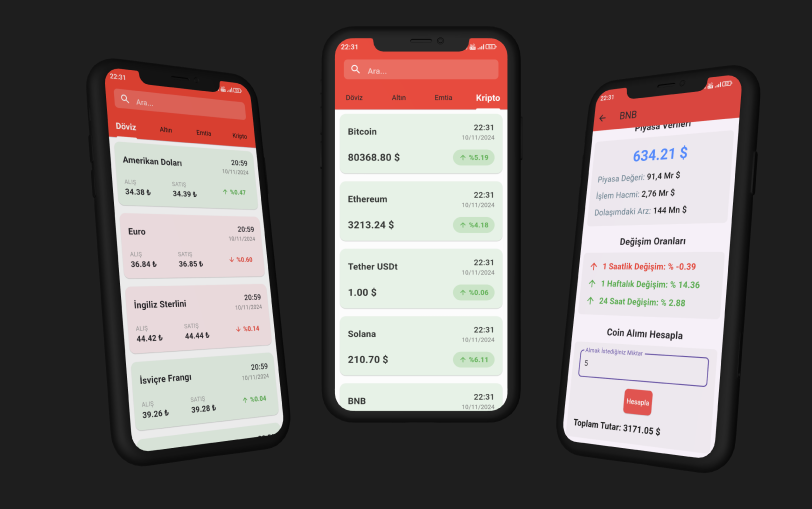

# CurrX

Bu proje, kripto para birimleri, döviz, altın ve emtia fiyatlarını takip etmek için geliştirilmiş bir mobil uygulamadır. Kullanıcılar, anlık fiyat değişimlerini ve farklı kategorilerdeki finansal verileri (kripto, döviz, altın, emtia) görüntüleyebilir. Uygulama, dinamik veri güncellemeleri ile kullanıcıların favori finansal enstrümanlarını takip etmelerine olanak tanır.

## Ekran Görüntüleri



## Özellikler

- **Kripto Para Takibi**: Popüler kripto paraların anlık fiyatlarını gösterir.
- **Döviz Takibi**: Ana döviz birimlerinin (USD, EUR, GBP vb.) fiyatlarını takip eder.
- **Altın Takibi**: Altın fiyatlarını, gram ve ons cinsinden görüntüler.
- **Emtia Takibi**: Farklı emtiaların fiyatlarını gösterir (örneğin, petrol, gümüş vb.).
- **Fiyat Değişim Oranı**: Finansal enstrümanların günlük fiyat değişim oranları canlı olarak gösterir.

## Kullanılan Kütüphaneler

- **GetX**: Durum yönetimi, bağımlılık çözümü ve yönlendirme işlemleri için tercih edildi.
- **Dio**: REST API'lerden veri almak için kullanıldı.
- **Intl**: Tarih ve saat formatlama işlemleri için kullanıldı.
- **Lottie**: Animasyonlu Splash Screen oluşturmak için kullanıldı.

## Projeyi Çalıştırmak


1. **Projeyi Klonlayın**:
    ```bash
    git clone https://github.com/mehmetakifkucukkaya/currx-flutter.git
    
    cd currx-flutter
    ```

2. **Gerekli Paketleri Yükleyin**:
    ```bash
    flutter pub get
    ```
    
3. **Uygulamayı Çalıştırın**:
    ```bash
    flutter run
    ```


